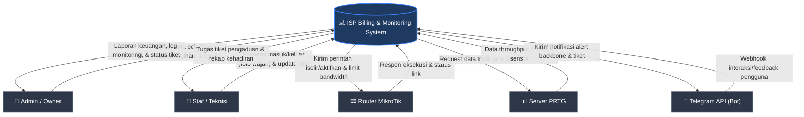

# Dokumen Arsitektur: Diagram Konteks & Komposisi Sistem

Dokumen ini memuat penjelasan serta visualisasi struktur arsitektur aplikasi **ISP Billing & Monitoring System** yang terdiri atas **Diagram Konteks (Context Diagram)** dan **Diagram Komposisi (Composition/Component Diagram)** menggunakan notasi Mermaid.

---

## 1. Diagram Konteks (Context Diagram / DFD Level 0)

Diagram Konteks menunjukkan batas sistem aplikasi (System Boundary), entitas eksternal yang berinteraksi dengan sistem, serta aliran data masuk dan keluar antara entitas eksternal dengan sistem.

### 🖼️ Gambar Visual Diagram Konteks




### Penjelasan Aliran Data (Data Flows):
* **Admin / Owner**:
  - **Input**: Mengonfigurasi pengaturan sistem, mengelola data paket internet, pendaftaran pelanggan baru, pembuatan tagihan bulanan, serta memantau kinerja jaringan.
  - **Output**: Memperoleh visualisasi analitik keuangan, log status backbone, dan laporan tiket keluhan yang sedang ditangani oleh staf.
* **Staf / Teknisi**:
  - **Input**: Melakukan absensi harian dengan verifikasi foto wajah serta mengunggah bukti penyelesaian gangguan (foto & status tiket).
  - **Output**: Menerima disposisi tugas tiket gangguan dari admin dan status lembur/presensi mereka sendiri.
* **Router MikroTik**:
  - **Input**: Menerima perintah otomatis dari sistem untuk mengisolir IP pelanggan yang menunggak pembayaran, membuka isolir jika lunas, serta pengaturan limitasi bandwidth (Simple Queue/Queue Tree).
* **Server PRTG**:
  - **Input**: Sistem memanggil API PRTG untuk menarik data trafik link secara real-time.
* **Telegram API**:
  - **Output**: Mengirimkan pesan notifikasi instan apabila perangkat backbone terdeteksi down atau ada tiket pengaduan baru dari pelanggan ke grup internal staf.

---

## 2. Diagram Komposisi (Composition / Component Architecture Diagram)

Diagram Komposisi menunjukkan komponen-komponen internal pembentuk sistem, pembagian layer (Frontend, Backend, Database), serta bagaimana komponen tersebut saling terhubung satu sama lain.

### 🖼️ Gambar Visual Diagram Komposisi


```mermaid
rect fill:#f7fafc,stroke:#edf2f7
    subgraph Client_Layer [🖥️ Client Side / Browser]
        FE_React["⚛️ React SPA (Inertia.js)"]
        Cam_API["📷 Web Camera API (Presensi)"]
    end
end

rect fill:#f7fafc,stroke:#edf2f7
    subgraph Backend_Layer [⚙️ Laravel Backend Application]
        Router["📌 Laravel Routing / Middleware"]
        
        %% Controllers
        subgraph Controllers [Controllers]
            C_Cust["CustomerController"]
            C_Inv["InvoiceController"]
            C_Tick["TicketController"]
            C_Pres["PresensiController"]
            C_Back["BackboneDeviceController"]
        end
        
        %% Services
        subgraph Services_Layer [Services & Integrations]
            S_Mkt["MikrotikService (RouterosAPI)"]
            S_Tel["TelegramBotService"]
            S_Prtg["PRTG API Service"]
            S_Face["FaceRecognition Helper"]
        end
        
        %% Daemons
        subgraph Background_Jobs [Daemons & Scheduler]
            D_Back["monitor:backbone Command (Systemd)"]
            Scheduler["Laravel Scheduler (Cron)"]
        end
    end
end

rect fill:#f7fafc,stroke:#edf2f7
    subgraph Database_Layer [🗄️ Database Storage]
        DB[("Storage: MySQL Database")]
    end
end

%% Hubungan Antar Komponen
FE_React <-->|"HTTP Requests / Inertia Router"| Router
Cam_API -->|"Upload Base64 Image"| FE_React

Router <--> C_Cust
Router <--> C_Inv
Router <--> C_Tick
Router <--> C_Pres
Router <--> C_Back

C_Cust <--> S_Mkt
C_Pres <--> S_Face
C_Tick --> S_Tel

C_Cust <--> DB
C_Inv <--> DB
C_Tick <--> DB
C_Pres <--> DB
C_Back <--> DB

D_Back <--> DB
D_Back -->|"Ping IP Perangkat"| Ext_Back["📟 Perangkat Jaringan (Backbone)"]
D_Back -->|"Alert Down"| S_Tel
Scheduler -->|"Generate Tagihan Bulanan"| C_Inv

S_Mkt <-->|"Port 8728 API"| Ext_Mikro["📟 Router MikroTik"]
S_Tel -->|"HTTPS Post"| Ext_Tel["💬 Telegram Bot API"]
S_Prtg <-->|"HTTPS Get"| Ext_PRTG["📊 Server PRTG"]
```

### Penjelasan Komponen Internal:

1. **Layer Client (Frontend)**:
   - **React SPA**: Berfungsi merender antarmuka pengguna (Dashboard, Grafik Monitoring, Pengaturan, Tiket) dengan responsif.
   - **Web Camera API**: Mengambil tangkapan foto wajah langsung (capture) untuk kebutuhan presensi masuk/pulang karyawan.
2. **Layer Backend (Laravel)**:
   - **Laravel Router & Middleware**: Mengamankan rute berdasarkan otentikasi sesi dan role (Admin/Staff) serta mengarahkan request ke controller yang tepat.
   - **Controllers**: Unit logika bisnis utama untuk mengelola entitas (Customer, Invoice, Ticket, Presensi, dan BackboneDevice).
   - **Services & Integrations**:
     - *MikrotikService*: Membuka soket koneksi menggunakan protokol RouterOS API untuk manajemen status IP pelanggan.
     - *TelegramBotService*: Handler terenkripsi untuk mengirim log status/notifikasi melalui Telegram API.
     - *PRTG API Service*: Service khusus untuk mengkueri visualisasi link metric.
     - *FaceRecognition Helper*: Helper untuk memproses pencocokan visual wajah presensi.
   - **Daemons & Scheduler**:
     - *MonitorBackbone Command*: Proses background daemon (systemd service) yang berjalan tanpa henti untuk melakukan ping berkala ke semua IP backbone dan mengirim alert jika terjadi down.
     - *Laravel Scheduler*: Menjalankan tugas berkala (Cron Job per menit) untuk pembaharuan jatuh tempo invoice.
3. **Layer Database (Storage)**:
   - **MySQL Database**: Menyimpan data relasional terstruktur (pengguna, pelanggan, invoice, log kehadiran, dsb) dengan indeks teroptimasi.
