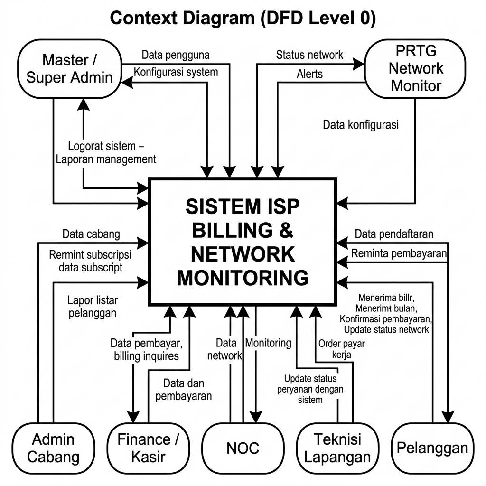
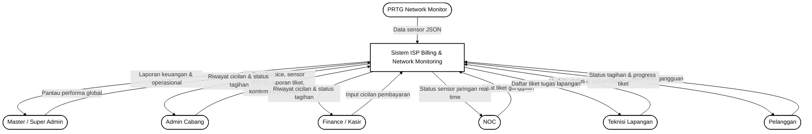
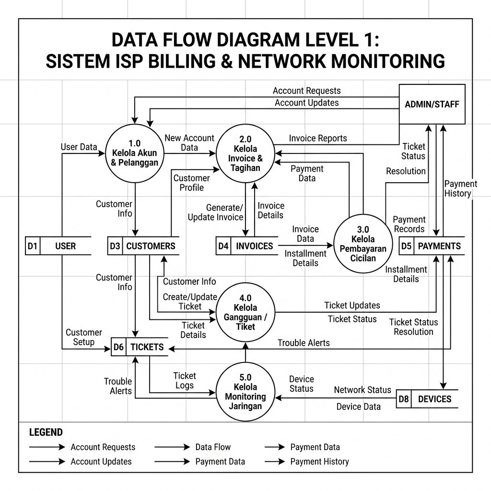
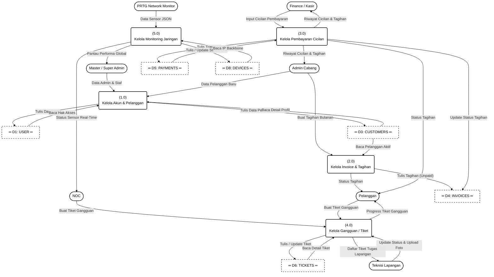
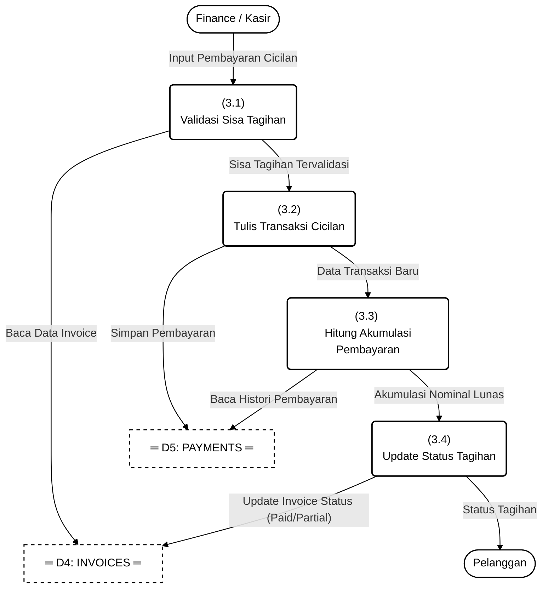
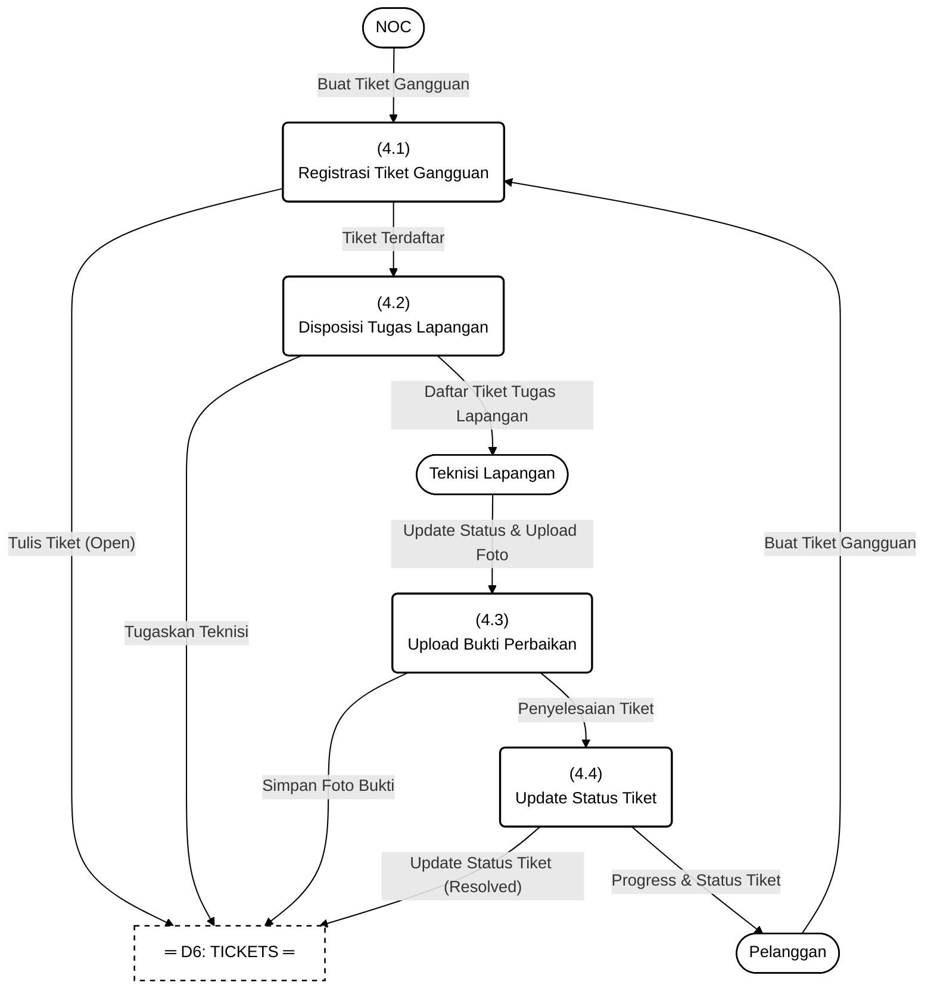

# 📊 Dokumentasi Data Flow Diagram (DFD) Lengkap
## ISP Billing & Monitoring System (Sesuai Desain Context Diagram Baru)

Dokumen ini menyajikan rancangan **Data Flow Diagram (DFD)** lengkap mulai dari **Level 0 (Diagram Konteks)**, **Level 1 (Dekomposisi Proses)**, hingga **Level 2** untuk sistem ISP Billing & Monitoring Anda. Struktur entitas, alur data, dan penamaan proses disesuaikan secara presisi dengan desain diagram konteks baru yang Anda berikan.

---

## 1. DFD Level 0 (Diagram Konteks / Context Diagram)
Diagram Konteks memposisikan sistem utama di tengah sebagai kotak persegi panjang, dengan 7 entitas luar berbentuk kapsul/stadium di sekelilingnya yang saling bertukar data secara langsung.

### 🖼️ Gambar Visual Diagram Konteks

### 💻 Diagram Kode (Mermaid)

---

## 2. DFD Level 1 (Diagram Dekomposisi Proses)
DFD Level 1 memecah sistem menjadi **5 proses utama** yang saling berinteraksi dengan **6 data store** utama untuk mengelola siklus akun, invoice, cicilan pembayaran, ticketing, dan pemantauan link real-time.

### 🖼️ Gambar Visual DFD Level 1

### 💻 Diagram Kode (Mermaid)

---

## 3. DFD Level 2 (Rincian Proses Detail)

### DFD Level 2 - Proses 3.0: Kelola Pembayaran Cicilan

---

### DFD Level 2 - Proses 4.0: Kelola Gangguan / Tiket

---

## 📖 Kamus Penjelasan Setiap Aliran Data (Data Flow Dictionary)

### A. Aliran Data - DFD Level 0 (Diagram Konteks)

| No | Sumber (Source) | Tujuan (Destination) | Nama Aliran Data | Kandungan & Penjelasan Data |
|:---|:---|:---|:---|:---|
| **1** | Master / Super Admin | Sistem | Pantau performa global | Memantau seluruh aktivitas sistem, log monitoring, performa kasir, dan status teknisi lapangan. |
| **2** | Sistem | Master / Super Admin | Laporan keuangan & operasional | Rekapitulasi pendapatan bulanan global, laporan absensi teknisi, dan performa jaringan. |
| **3** | PRTG Network Monitor | Sistem | Data sensor JSON | Pengiriman payload data JSON yang berisi status link interface, bandwidth real-time, dan alert link down. |
| **4** | Admin Cabang | Sistem | Data invoice, sensor PRTG, laporan tiket, konfirmasi pembayaran | Menginputkan data tagihan cabang, request status PRTG lokal, laporan keluhan tiket pelanggan cabang, serta verifikasi bayar. |
| **5** | Sistem | Admin Cabang | Riwayat cicilan & status tagihan | Menampilkan riwayat cicilan pembayaran pelanggan cabang serta status lunas/sebagian. |
| **6** | Finance / Kasir | Sistem | Input cicilan pembayaran | Memasukkan nominal pembayaran cicilan tagihan dari pelanggan beserta tanggal transaksi. |
| **7** | Sistem | Finance / Kasir | Riwayat cicilan & status tagihan | Menampilkan histori data angsuran cicilan tagihan pelanggan untuk dicetak sebagai tanda terima. |
| **8** | NOC | Sistem | Buat tiket gangguan | Menginput data aduan gangguan jaringan backbone atau masalah teknis client. |
| **9** | Sistem | NOC | Status sensor jaringan real-time | Menampilkan grafik pemantauan sensor throughput dan status keaktifan link interface secara langsung. |
| **10** | Teknisi Lapangan | Sistem | Update status & upload foto | Mengubah status tiket gangguan menjadi *Resolved* dan mengunggah foto bukti fisik perbaikan di lapangan. |
| **11** | Sistem | Teknisi Lapangan | Daftar tiket tugas lapangan | Menampilkan daftar antrean penugasan perbaikan gangguan internet pelanggan. |
| **12** | Pelanggan | Sistem | Buat tiket gangguan | Melaporkan keluhan koneksi internet terputus atau lambat melalui aplikasi pelanggan. |
| **13** | Sistem | Pelanggan | Status tagihan & progress tiket | Menampilkan total tunggakan billing, riwayat pembayaran, serta pelacakan status penanganan keluhan teknisi. |

---

## 🧭 Penjelasan Alur Jalannya Data (Data Flow Trace)

### 📶 Alur 1: Penagihan & Pembayaran Cicilan (Finance & Admin Cabang)
1. **Admin Cabang** membuat tagihan melalui sistem (**Proses 2.0**). Data tagihan disimpan di **D4 (Invoices)** dengan status awal `unpaid`.
2. Pelanggan mendatangi kasir untuk mengangsur tagihan. **Finance / Kasir** menginput data nominal angsuran ke **Proses 3.0**.
3. **Proses 3.0** menyimpan record angsuran baru ke **D5 (Payments)** dan memperbarui sisa tagihan di **D4 (Invoices)**.
4. **Finance / Kasir**, **Admin Cabang**, dan **Pelanggan** menerima pembaruan secara real-time mengenai **Riwayat cicilan & status tagihan**.

### 🛠️ Alur 2: Manajemen Gangguan & Dispatch Tiket (NOC, Pelanggan, & Teknisi)
1. **Pelanggan** atau **NOC** melaporkan kendala internet terputus ke sistem (**Proses 4.0**). Laporan tersebut disimpan di **D6 (Tickets)** dengan status `open`.
2. **Proses 4.0** menugaskan teknisi dan mengirimkan **Daftar tiket tugas lapangan** ke panel **Teknisi Lapangan**.
3. **Teknisi Lapangan** memperbaiki masalah di rumah pelanggan, lalu mengunggah status selesai beserta foto bukti perbaikan ke **Proses 4.0**.
4. **Proses 4.0** memperbarui status tiket di **D6 (Tickets)** menjadi `resolved` dan memperbarui halaman pelacakan **Pelanggan** mengenai **Progress tiket gangguan**.

### 📊 Alur 3: Monitoring & Sensor Real-Time (PRTG, NOC, & Master Admin)
1. **PRTG Network Monitor** secara konstan mengirimkan **Data sensor JSON** berisi metrik interface link ke sistem (**Proses 5.0**).
2. **Proses 5.0** memproses payload JSON tersebut dan memperbarui database log status link pada **D8 (Devices)**.
3. Petugas **NOC** memantau visualisasi grafik real-time tersebut pada panel monitoring.
4. **Master / Super Admin** mengakses sistem untuk melihat visualisasi performa global untuk kebutuhan analisis laporan operasional.
