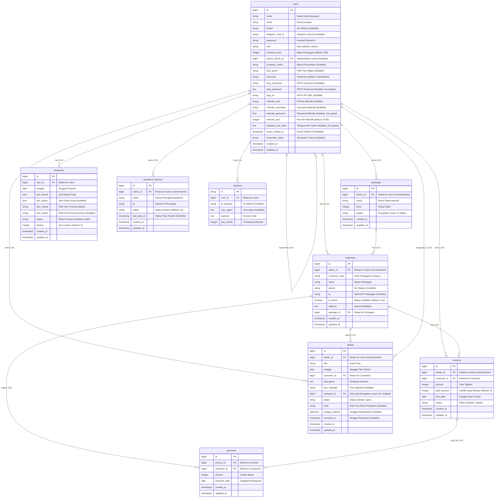

# Entity Relationship Diagram (ERD) - ISP Billing & Management System

Dokumen ini memuat skema dan rancangan Database (ERD) lengkap dari proyek **ISP Billing**. Diagram dan kamus data di bawah ini dibuat berdasarkan berkas migrasi database riil yang ada pada proyek ini, yang telah mencakup seluruh pembaharuan terbaru (termasuk perangkat backbone, multi-tenancy `admin_id`, token bot Telegram, dan enkripsi kolom sensitif).

---

## 🖼️ Gambar ERD (Visual Illustration & Rendering)

Untuk kenyamanan Anda dalam melihat rancangan database secara interaktif, beresolusi tinggi, dan dapat dizoom secara detail, silakan buka file HTML interaktif berikut di browser Anda:
👉 **[Buka ERD Render Interaktif (Localhost)](http://localhost/isp-billing/public/erd_render.html)**
*(Pastikan XAMPP/Apache Anda menyala pada direktori htdocs).*

### 🎨 Ilustrasi Visual ERD (Tech Conceptual Illustration)
Berikut adalah ilustrasi visual bertema modern dark mode untuk rancangan basis data ISP Billing Anda:


### 📊 Diagram Skema Rinci (Compiled Schema Diagram)
Berikut adalah gambaran skema detail dari setiap kolom, tipe data, dan garis relasi database:


---

## 📊 Diagram ERD (Mermaid)

Berikut adalah diagram relasi antarentitas dalam sistem. Anda dapat melihat visualisasi grafisnya jika editor Markdown Anda mendukung rendering Mermaid (seperti VS Code dengan ekstensi Markdown Preview, GitHub, GitLab, atau Obsidian).



---

## 📖 Kamus Data Lengkap (Data Dictionary)

### 1. Tabel `users`
Menyimpan data otentikasi pengguna, hak akses (roles), struktur organisasi/hierarki, kredensial integrasi PRTG & MikroTik, batas pelanggan, kontak Telegram, serta data pemindaian wajah untuk absensi.

| Nama Kolom | Tipe Data | Atribut | Keterangan / Deskripsi |
| :--- | :--- | :--- | :--- |
| `id` | bigint | Primary Key, Auto Increment | ID unik pengguna |
| `name` | string | - | Nama lengkap pengguna |
| `email` | string | Unique | Alamat email (untuk login) |
| `phone` | string | Nullable | Nomor telepon pengguna |
| `telegram_chat_id` | string | Nullable | ID Chat Telegram pengguna untuk notifikasi |
| `role` | string | Default: `'admin'` | Peran pengguna (misal: `'admin'`, `'staff'`, dll.) |
| `customer_limit` | integer | Default: `200`, Nullable | Batas jumlah pelanggan yang dapat dikelola |
| `parent_admin_id` | bigint | Foreign Key (users.id), Nullable | Referensi ke admin atasan langsung (jika staf) |
| `company_name` | string | Nullable | Nama instansi/perusahaan |
| `face_photo` | string | Nullable | Path file foto wajah terdaftar |
| `timezone` | string | Default: `'Asia/Jakarta'` | Zona waktu masing-masing pengguna |
| `prtg_url` | string | Nullable | Alamat URL host server PRTG |
| `prtg_username` | string | Nullable | Username integrasi PRTG |
| `prtg_password` | text | Nullable, Encrypted | Password integrasi PRTG (terenkripsi) |
| `mikrotik_host` | string | Nullable | IP / Host router MikroTik |
| `mikrotik_username` | string | Nullable | Username integrasi MikroTik |
| `mikrotik_password` | text | Nullable, Encrypted | Password integrasi MikroTik (terenkripsi) |
| `mikrotik_port` | integer | Default: `8728` | Port API MikroTik (default: `8728` API) |
| `telegram_bot_token` | text | Nullable, Encrypted | Token bot Telegram untuk notifikasi (terenkripsi) |
| `email_verified_at`| timestamp | Nullable | Tanggal email diverifikasi |
| `remember_token` | string | Nullable | Token remember-me Laravel |
| `created_at` | timestamp | Nullable | Waktu data dibuat |
| `updated_at` | timestamp | Nullable | Waktu data diubah terakhir kali |

### 2. Tabel `packages`
Menyimpan daftar paket internet / bandwidth yang ditawarkan kepada pelanggan.

| Nama Kolom | Tipe Data | Atribut | Keterangan / Deskripsi |
| :--- | :--- | :--- | :--- |
| `id` | bigint | Primary Key, Auto Increment | ID unik paket |
| `admin_id` | bigint | Foreign Key (users.id), Nullable | Pemilik/Admin yang membuat paket |
| `name` | string | - | Nama paket internet (misal: "Home Lite 10M") |
| `price` | integer | - | Harga bulanan paket dalam IDR |
| `speed` | string | - | Deskripsi kecepatan paket (misal: "10 Mbps") |
| `created_at` | timestamp | Nullable | Waktu data dibuat |
| `updated_at` | timestamp | Nullable | Waktu data diubah terakhir kali |

### 3. Tabel `customers`
Menyimpan data profil pelanggan ISP, paket yang berlangganan, serta status integrasi jaringan (Alamat IP).

| Nama Kolom | Tipe Data | Atribut | Keterangan / Deskripsi |
| :--- | :--- | :--- | :--- |
| `id` | bigint | Primary Key, Auto Increment | ID unik pelanggan |
| `admin_id` | bigint | Foreign Key (users.id), Nullable | Pemilik/Admin yang mengelola pelanggan ini |
| `customer_code` | string | Unique | Kode unik pelanggan (misal: C001, C002) |
| `name` | string | - | Nama lengkap pelanggan |
| `phone` | string | Nullable | Nomor telepon pelanggan |
| `ip` | string | Nullable | Alamat IP statis pelanggan di router/jaringan |
| `is_active` | boolean | Default: `true` | Status keaktifan internet pelanggan (isolir/aktif) |
| `address` | text | Nullable | Alamat fisik instalasi pelanggan |
| `package_id` | bigint | Foreign Key (packages.id), Cascade | ID paket internet yang diambil |
| `created_at` | timestamp | Nullable | Waktu data dibuat |
| `updated_at` | timestamp | Nullable | Waktu data diubah terakhir kali |

### 4. Tabel `invoices`
Mencatat tagihan bulanan pelanggan berdasarkan harga paket yang aktif.

| Nama Kolom | Tipe Data | Atribut | Keterangan / Deskripsi |
| :--- | :--- | :--- | :--- |
| `id` | bigint | Primary Key, Auto Increment | ID unik tagihan |
| `admin_id` | bigint | Foreign Key (users.id), Nullable | Pemilik/Admin dari transaksi tagihan |
| `customer_id` | bigint | Foreign Key (customers.id), Cascade | Referensi pelanggan tertagih |
| `amount` | integer | - | Jumlah total tagihan awal |
| `paid_amount` | integer | Default: `0` | Nominal yang sudah terbayar |
| `due_date` | date | - | Tanggal batas akhir pembayaran |
| `status` | string | Default: `'unpaid'` | Status tagihan (misal: `'paid'`, `'unpaid'`, `'partial'`) |
| `created_at` | timestamp | Nullable | Waktu data dibuat |
| `updated_at` | timestamp | Nullable | Waktu data diubah terakhir kali |

### 5. Tabel `payments`
Mencatat transaksi pembayaran nyata yang dilakukan oleh pelanggan untuk melunasi tagihannya.

| Nama Kolom | Tipe Data | Atribut | Keterangan / Deskripsi |
| :--- | :--- | :--- | :--- |
| `id` | bigint | Primary Key, Auto Increment | ID unik transaksi pembayaran |
| `invoice_id` | bigint | Foreign Key (invoices.id), Cascade | Tagihan yang dibayarkan |
| `customer_id` | bigint | Foreign Key (customers.id), Cascade | Pelanggan pembayar |
| `amount` | integer | - | Nominal uang yang dibayarkan |
| `payment_date` | date | - | Tanggal pembayaran dilakukan |
| `created_at` | timestamp | Nullable | Waktu data dibuat |
| `updated_at` | timestamp | Nullable | Waktu data diubah terakhir kali |

### 6. Tabel `tickets`
Menyimpan laporan pengaduan gangguan/kendala teknis dari pelanggan, serta staf teknisi yang bertugas menyelesaikannya.

| Nama Kolom | Tipe Data | Atribut | Keterangan / Deskripsi |
| :--- | :--- | :--- | :--- |
| `id` | bigint | Primary Key, Auto Increment | ID unik tiket keluhan |
| `admin_id` | bigint | Foreign Key (users.id), Nullable | Pemilik/Admin yang mengelola tiket |
| `title` | string | - | Judul singkat keluhan |
| `tanggal` | date | - | Tanggal laporan dibuat |
| `customer_id` | bigint | Foreign Key (customers.id), Cascade | Pelanggan yang melapor |
| `description` | text | - | Detail kendala teknis |
| `foto_masalah` | string | Nullable | Path foto kendala yang dialami |
| `assigned_to` | bigint | Foreign Key (users.id), Nullable | Teknisi/staf yang ditugaskan |
| `status` | string | Default: `'open'` | Status penanganan (misal: `'open'`, `'resolved'`, `'closed'`) |
| `bukti` | string | Nullable | Path/nama file bukti foto perbaikan |
| `tanggal_selesai`| dateTime | Nullable | Tanggal & waktu penyelesaian kendala |
| `archived_at` | timestamp | Nullable | Waktu arsip tiket |
| `created_at` | timestamp | Nullable | Waktu data dibuat |
| `updated_at` | timestamp | Nullable | Waktu data diubah terakhir kali |

### 7. Tabel `presensis`
Mencatat rekap absensi harian staf (pengguna) menggunakan pencocokan verifikasi foto wajah.

| Nama Kolom | Tipe Data | Atribut | Keterangan / Deskripsi |
| :--- | :--- | :--- | :--- |
| `id` | bigint | Primary Key, Auto Increment | ID unik presensi |
| `user_id` | bigint | Foreign Key (users.id), Cascade | Staf yang melakukan presensi |
| `tanggal` | date | - | Tanggal kerja |
| `jam_masuk` | time | - | Jam presensi masuk |
| `jam_keluar` | time | Nullable | Jam presensi pulang |
| `foto_masuk` | string | - | Path file foto saat absen masuk |
| `foto_keluar` | string | Nullable | Path file foto saat absen keluar |
| `status` | string | Default: `'Hadir'` | Keterangan status kehadiran |
| `lembur` | integer | Default: `0` | Durasi lembur dalam hitungan jam |
| `created_at` | timestamp | Nullable | Waktu data dibuat |
| `updated_at` | timestamp | Nullable | Waktu data diubah terakhir kali |

### 8. Tabel `backbone_devices`
Menyimpan daftar perangkat infrastruktur utama jaringan (backbone) yang diping secara berkala untuk monitoring keaktifan jaringan.

| Nama Kolom | Tipe Data | Atribut | Keterangan / Deskripsi |
| :--- | :--- | :--- | :--- |
| `id` | bigint | Primary Key, Auto Increment | ID unik perangkat backbone |
| `admin_id` | bigint | Foreign Key (users.id), Cascade | Admin/Owner pemilik perangkat |
| `name` | string | - | Nama identitas perangkat backbone |
| `ip` | string | - | Alamat IP perangkat backbone |
| `status` | string | Default: `'up'` | Status perangkat (`'up'` atau `'down'`) |
| `last_ping_at` | timestamp | Nullable | Waktu ping terakhir kali dilakukan |
| `created_at` | timestamp | Nullable | Waktu data dibuat |
| `updated_at` | timestamp | Nullable | Waktu data diubah terakhir kali |

---

## 🛠️ Indeks Database (Performance Optimization)

Database ini dilengkapi dengan indeks tambahan pada beberapa tabel utama untuk mempercepat performa pencarian (pencarian status, filter tanggal, dll):
* **Tabel `presensis`**: Indeks pada kolom `tanggal`.
* **Tabel `invoices`**: Indeks pada kolom `status`, serta indeks pada `admin_id` (untuk mempercepat filter kepemilikan tagihan per admin).
* **Tabel `tickets`**: Indeks pada kolom `status`, `tanggal`, serta indeks pada `admin_id`.
* **Tabel `customers`**: Indeks pada kolom `admin_id`.
* **Tabel `packages`**: Indeks pada kolom `admin_id`.
* **Tabel `backbone_devices`**: Indeks pada kolom `admin_id`.

---

## 🔍 Catatan & Temuan Struktur Relasi Model Laravel

Selama analisis model dan database, terdapat ketidaksesuaian kecil antara berkas model Eloquent Laravel dengan skema migrasi database fisik:
* Pada model [User.php](file:///d:/xampp/htdocs/isp-billing/app/Models/User.php#L47-L50), dideklarasikan relasi `payments()`:
  ```php
  public function payments() {
      return $this->hasMany(Payment::class);
  }
  ```
  Namun, pada skema tabel `payments` di database, kolom **`user_id`** tidak terdaftar. Tabel `payments` hanya menyimpan relasi ke `invoice_id` dan `customer_id`. Apabila relasi ini dipanggil (`$user->payments`), hal ini akan memicu error query SQL kecuali kolom `user_id` ditambahkan atau relasi tersebut disesuaikan.
